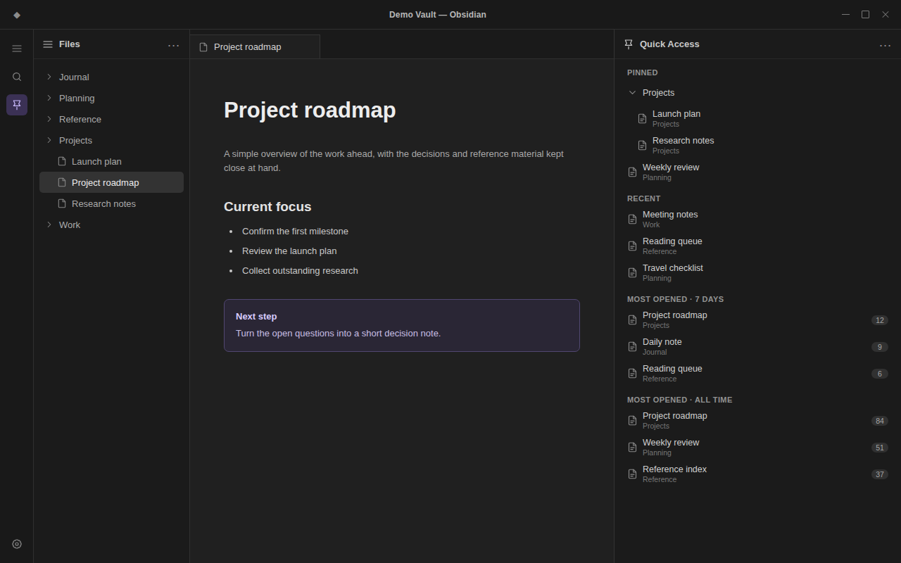

# Quick Access Dashboard

A privacy-conscious Obsidian sidebar that keeps pinned files and folders, recent files, and most-opened files together.



*Shown with synthetic example data.*

## Features

- Pin files and expandable folders.
- See the 12 most recently active files.
- Rank files by opens over the current local day and six preceding local calendar days.
- Rank files by opens since tracking began or was reset.
- Follow file and folder renames, and remove deleted paths automatically.
- Reset all device-local access statistics without removing pins.

## Usage

- Select the pin icon in the ribbon or run **Open dashboard** from the command palette.
- Right-click a file or folder and select **Pin to Quick Access**.
- Run **Pin or unpin active file** to toggle the current file.
- Select a file to open it. Ctrl-click, Cmd-click, or middle-click opens it in a new tab.
- Run **Reset access statistics** to clear recent and most-opened data on the current device.

## What counts as an access

A file is counted when it becomes the active file in Obsidian's interface. This includes normal navigation and CLI or URI commands that open a file in the interface.

Background reads, searches, indexing, sync, edits, hover previews, and embedded notes do not count. Duplicate events for the same active file are ignored; switching away and back counts as another access. Restored startup tabs establish a baseline without incrementing it.

Statistics begin after installation. The plugin cannot reconstruct earlier access history.

## Data and privacy

The plugin has no runtime dependencies, network calls, telemetry, advertising, shell access, dynamic code execution, editor-transaction listeners, or note-content access.

Pins use Obsidian's normal plugin data. Access activity uses Obsidian's vault-specific local storage and stays on the device. Stored activity is limited to file paths, a recent-path list, aggregate totals, last-open timestamps, and seven local-date count buckets. The plugin does not retain a raw event log.

## Installation

### Community plugins

1. Open **Settings → Community plugins → Browse**.
2. Search for **Quick Access Dashboard**.
3. Select **Install**, then **Enable**.

### Manual installation

Download `main.js`, `manifest.json`, and `styles.css` from the latest GitHub release and place them in:

```text
<vault>/.obsidian/plugins/quick-access-dashboard/
```

Reload Obsidian, then enable **Quick Access Dashboard** under **Settings → Community plugins**.

## Compatibility

The current beta supports Obsidian 1.13.0 or later on desktop. Mobile support has not yet been validated.

## Development

There are no packages to install. The build and tests use only Node.js standard-library modules.

```bash
node build.js
node --test test/*.test.js
```

`build.js` combines `model.js` and `plugin.js` into the self-contained `main.js` required by Obsidian.

## Security

Please report vulnerabilities through this repository's private vulnerability reporting. Use synthetic paths and note names in reports rather than real vault data.

## License

[MIT](LICENSE)
